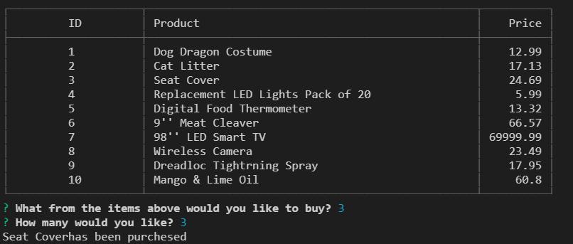

# bamazon

Hello and welcome to Bamazon. This Amazon type programe made with Node.js and MySQL.

While using this programe you can go though the list of the stores inventory you can check the price of the item and how many are in stock and fill your order. 

If there isn't enough of the item that you chose then you'll be told that there isnt enough and asked to chose something else.

;

